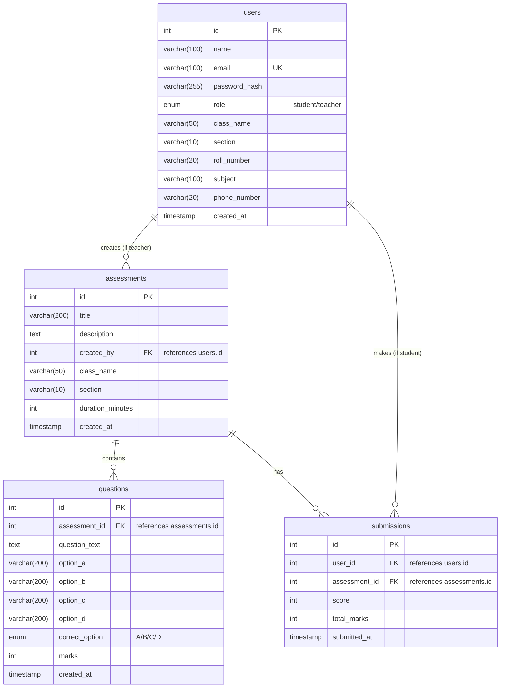

# Knowledge Assessment System ER Diagram

Below is the Entity-Relationship Diagram for your database. You can view this using any Markdown previewer that supports Mermaid.js, such as the built-in VS Code preview (with a Mermaid extension) or by pasting it into a tool like [Mermaid Live Editor](https://mermaid.live).

